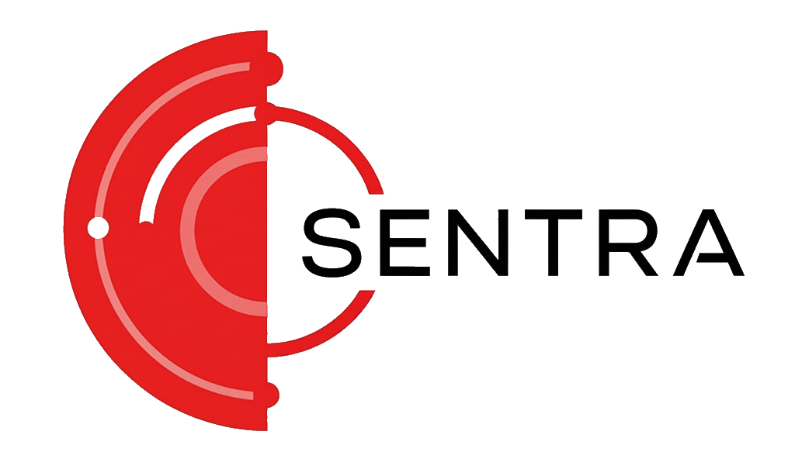

<p align="center">
<a href="#"></a>
</p>

<h1 align="center">SENTRA - All-in-one Penetration testing tool</h1>

<em><h5 align="center">Developed by Rafacuy (arazz.)</h5></em>


<p align="center">
    <a href="#">
        
    </a>
    <a href="#">
        
    </a>
    <a href="#">
        
    </a>
    <a href="https://github.com/Rafacuy/Sentra/issues">
        
    </a>
</p>

SENTRA is a powerful yet beginner-friendly penetration testing tool designed to automate and simplify the process of discovering common web vulnerabilities. With an intuitive terminal UI powered, it offers quick access to essential reconnaissance and scanning features.

## Features
- 🔎 **Directory Bruteforcer** — Discover hidden directories on target web servers.
- 🌐 **Subdomain Discovery** — Identify subdomains using a wordlist-based scanner.
- ⚖️ **Security Header Audit** — Analyze HTTP response headers for security best practices.
- 🔒 **Advanced SSL/TLS Inspector** — Get deep insights into SSL certificate configurations.
- 📀 **Website Scraper** — Extract page content and links quickly.
- ⚡ **Website Vulnerability Scanner** — Detect common web application vulnerabilities.

---

## Installation

1. **Clone the Repository**
```bash
https://github.com/Rafacuy/Sentra.git
cd Sentra
```

2. **Install Dependencies**
```bash
bash install.sh
```
Or install the `requirements.txt` directly:
```bash
pip install -r requirements.txt
```

And install the `tls-client` using golang:
```bash
go install github.com/bp0lr/tls-client@latest
```

3. **Run SENTRA**
```bash
python sentra.py
```

### Trouble installing on Termux?

If you're facing issues with `cryptography` or build tools, just run:
```bash
bash FIX.sh # Only for termux users
```
This script will auto-install Termux dependencies for you.

---

## Requirements
- Python 3.7+
- `rich`, `requests`, `beautifulsoup4`, and other libraries listed in `requirements.txt`

## Wordlists
Custom wordlists for:

* Directory brute-forcing

* Subdomain enumeration

* Admin panel discovery

_Located in /wordlists/_

## Contributing
Pull requests are welcome! If you find bugs or want to suggest features, open an issue or fork the repo and submit a PR.
Also you can chat me casualy on My [TikTok](https://tiktok.com/@rafardhancuy) account.

## Disclaimer
This tool is intended for **educational** and **authorized testing** only. Unauthorized usage against targets without permission is **illegal** and unethical.

## LICENSE
This tool is under the GPL-3.0 License. See the [LICENSE](./LICENSE) for details.

## Author
**Rafacuy** — [@Rafacuy](https://github.com/Rafacuy)

---


